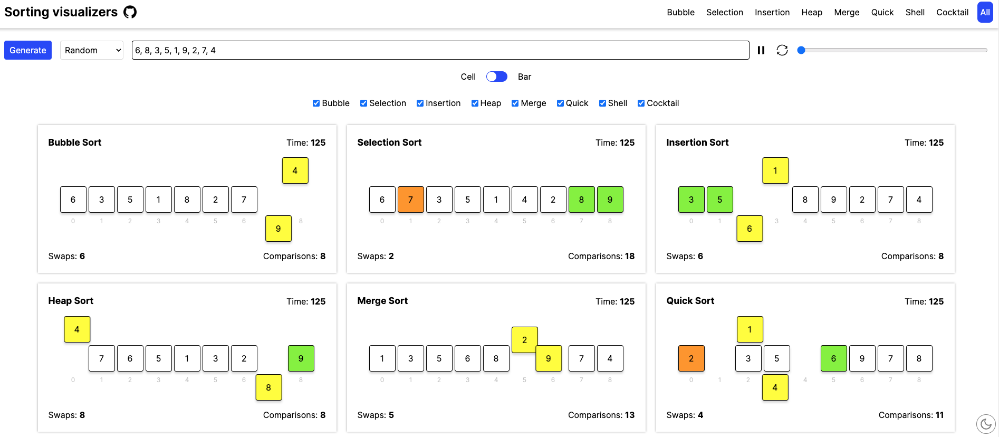
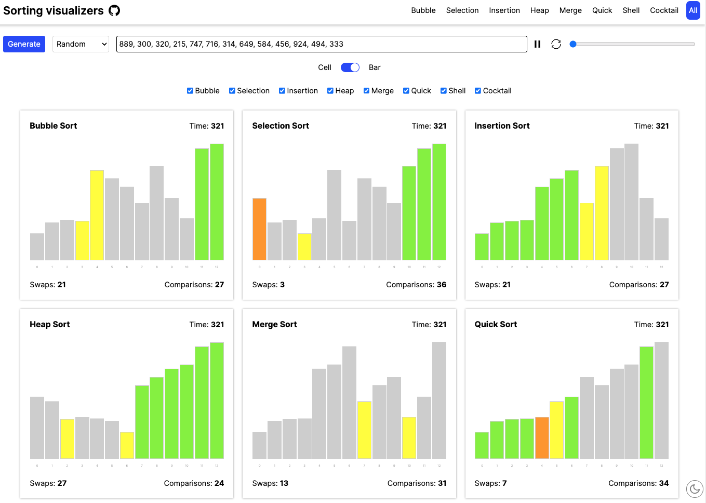

  <h1>Algorithms Visualizers</h1>
  <h2>Responsive visualizers built using React for popular algorithms</h2>
  

    
  

 

 

---

### Algorithms Visualizers

This repo helps in learning popular algorithms by visualization

  
Sorting Visualizer

 

Helps to

- understand the working of sorting algorithm
- check total swaps required
- check total comparisions
- compare algorithms side by side
- know the time taken (time is just an approximate unit for comparision)

Features

- Sort any given array of 3 digits positive integers
- Alter the speed of execution
- Start, pause and reset the execution
- Generate random array of numbers of sorting

Concepts

- Animations are done using pure CSS and uses
  [FLIP principle](https://aerotwist.com/blog/flip-your-animations/)
- Flex is used for array display and manipulation of positions (flex order
  property)
- JavaScript async generators are used heavily for the controlled execution of
  algorithms
- Redux is used for state management
- React hooks are used for state management and lifecycle methods

 

### Technologies

Production libraries

- [React](https://react.dev/) (Frontend Library)
- [Redux Toolkit](https://redux-toolkit.js.org/) (State management)
- [React Router](https://reactrouter.com/en/main/) (Router)
- [Lucide](https://lucide.dev/) (Icons pack)
- [Sonner](https://sonner.emilkowal.ski/) (Toast)
- [React-use](https://github.com/streamich/react-use) (Custom hooks)
- [React Joyride](https://react-joyride.com/) (App tour)
- [React Switch](https://react-switch.netlify.app/) (Switch)

Build libraries

- [Sass](https://sass-lang.com/) (CSS compiler)
- [Vite](https://vitejs.dev/) (Bundler)
- [Vitest](https://vitest.dev/) (Unit test)
- [Cypress](https://www.cypress.io/) (E2E test)

 

### Run in your local

- `git clone https://github.com/Annany2002/Sorting_Visualizer.git`
- `cd algo-visualizers`
- `npm install`
- `npm run dev`

---

### Contributing Guide

If you want to contribute, improve or fix bugs in this repo, then check out the
[Contributing Guide](./CONTRIBUTING.md)  

 

### License

This repository is MIT licensed. [Read more](./LICENSE)
